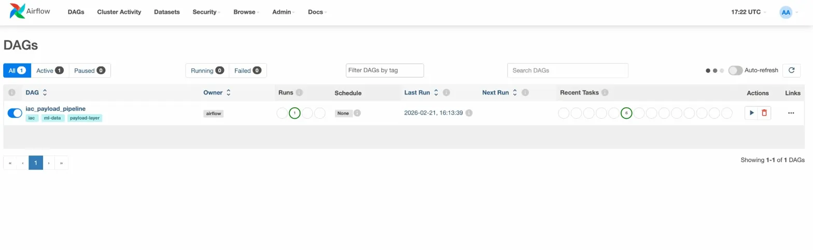
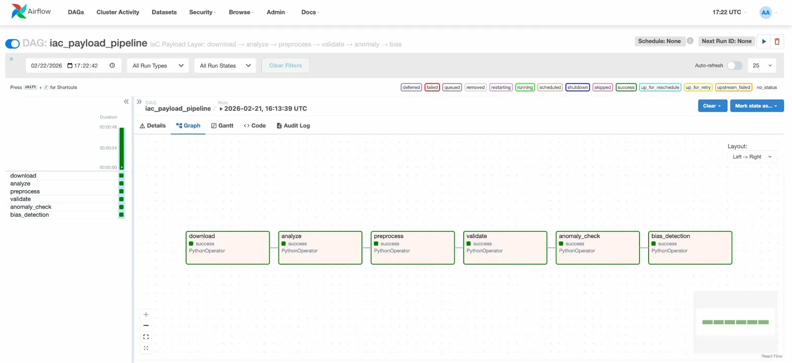

# AutoMend — Data Pipeline

AutoMend trains a language model to automatically fix and deploy Kubernetes infrastructure by learning from real-world configuration files.

This pipeline builds the training data, it takes raw Kubernetes YAML files from GitHub, cleans them, and converts them into tool-call training examples that teach the model to respond to natural language instructions like _"Deploy the GPU serving configuration"_ with a valid, properly-formatted YAML manifest.

---

## Data Acquisition

We stream YAML files directly from [`bigcode/the-stack-dedup`](https://huggingface.co/datasets/bigcode/the-stack-dedup) — a large open-source code dataset from GitHub. Only the YAML sub-corpus is used (64 parquet shards, ~10,000 rows sampled).

- Streaming means we never download the full dataset — memory stays flat
- Duplicate files are removed using their `hexsha` content hash
- Everything is config-driven via `config/iac_analysis.yaml`
- Results are reproducible — `dvc.lock` pins the exact dataset version



---

## Data Preprocessing

Each raw YAML file goes through 5 steps before becoming a training record:

**1. Filter** — keeps only files that are:

- Between 200 bytes and 200KB
- Valid `.yaml` or `.yml` files
- Real Kubernetes manifests (must have `apiVersion` + `kind`)
- Parseable YAML
- Permissively licensed (MIT, Apache-2.0, BSD, etc.)
- Containing an ML infra keyword (`nvidia.com/gpu`, `kserve`, `seldon`, etc.)

**2. PII Redaction** — removes sensitive data before training:

- IP addresses → `IPV4_REDACTED`
- API keys (`sk-...`) → `sk-REDACTED`
- Emails → `REDACTED_EMAIL`
- Password/token fields → `REDACTED_CREDS`

**3. Re-validate** — re-parses the YAML after redaction to make sure the substitution didn't break the structure

**4. Prompt Synthesis** — converts the filename into a natural language instruction:

```
gpu-model-server.yaml   →  "Apply the GPU serving configuration: gpu model server."
prod-deployment.yaml    →  "Deploy the production configuration: prod deployment."
```

**5. Wrap + Escape** — packages everything into the `apply_manifest` tool-call format using `json.dumps` to handle all escaping safely

Final output per record:

```json
{
  "messages": [
    {
      "role": "user",
      "content": "Apply the GPU serving configuration: gpu model server."
    },
    {
      "role": "assistant",
      "content": "{\"tool\": \"apply_manifest\", \"params\": {\"manifest_content\": \"apiVersion: apps/v1\\nkind: Deployment...\"}}"
    }
  ]
}
```

---

## Test Modules

- We wrote comprehensive unit tests to validate the core functionality of every module in the pipeline — `stack_iac_sample.py`, `payload_preprocess.py`, `schema_stats.py`, `anomaly_alerts.py`, and `bias_detection.py`.
- All tests are written with `pytest`, use no temporary files or directories, and run independently without needing any external data, network access, or HuggingFace credentials.
- Additional validation is done via `scripts/diagnostic.py` — run manually after download to verify filter yield, keyword coverage, PII exposure, and JSON escaping correctness end-to-end.

```bash
pytest tests/test_pipeline.py -v
```

Tests cover: filter gates, PII redaction, prompt synthesis, JSON escaping, schema validation, anomaly checks, bias classifiers, and the full end-to-end row transform.

---

## Pipeline Orchestration (Airflow DAG)

The entire pipeline runs as a single Airflow DAG: `iac_payload_pipeline`

```
download → analyze → preprocess → validate → anomaly_check → bias_detection
```

- **Manual trigger only** — no scheduled runs
- All 6 tasks use `PythonOperator`
- Total runtime: ~48 seconds




Trigger via UI: http://localhost:8081 → `iac_payload_pipeline` → ▶

Trigger via CLI:

```bash
docker compose exec airflow-scheduler airflow dags trigger iac_payload_pipeline
```

---

## Data Versioning with DVC

All data files and report outputs are tracked with DVC alongside the Git history.

```bash
dvc repro          # re-run the pipeline (skips unchanged stages)
dvc dag            # show the dependency graph
dvc metrics show   # see current output metrics
dvc metrics diff   # compare metrics across commits
```

`dvc.lock` pins exact content hashes so anyone can reproduce the same results by running `dvc pull` + `dvc repro`.

---

## Tracking and Logging

Every script writes structured logs using Python's `logging` module — timestamps, severity levels, and filenames for every stage.

| Stage          | Log file                  |
| -------------- | ------------------------- |
| Download       | `logs/download.log`       |
| Analyze        | `logs/analysis.log`       |
| Preprocess     | `logs/preprocess.log`     |
| Validate       | `logs/schema_stats.log`   |
| Anomaly check  | `logs/anomaly_alerts.log` |
| Bias detection | `logs/bias_detection.log` |

Logs are also captured by Airflow and visible in the task log viewer.

---

## Data Schema & Statistics Generation

`scripts/validate/schema_stats.py` validates every training record against 6 checks — required keys present, correct role order, valid JSON, correct tool name, valid YAML in the manifest, and no PII leakage.

Output `logs/schema_report.json`:

```json
{
  "total": 43,
  "valid": 43,
  "pass_rate_pct": 100.0,
  "violation_counts": {}
}
```

---

## Anomaly Detection & Alerts

`scripts/validate/anomaly_alerts.py` reads the schema report and fires alerts if:

- Pass rate drops below 80%
- Any PII leaks through to the output
- Any single violation type exceeds 50 records
- Fewer than 10 records were written

Alerts go to Slack if `SLACK_WEBHOOK_URL` is set, otherwise logged as `CRITICAL`.

Output `logs/anomaly_report.json`:

```json
{
  "status": "PASS",
  "anomalies_found": 0
}
```

---

## Bias Detection & Mitigation

`scripts/validate/bias_detection.py` checks whether any category of manifest is over- or under-represented in the training data.

**Detection** — slices records across 4 dimensions and flags imbalances:

- IaC type (kserve / seldon / k8s_workload / k8s_config)
- License (MIT / Apache-2.0 / BSD)
- File size (<1KB / 1-10KB / 10-100KB)
- Prompt type (deploy / gpu / inference / service / fallback)

**Mitigation** — if any `iac_type` slice exceeds 40% of total, it is downsampled:

- Uses `random.Random(seed=42)` — reproducible every run
- Adds a `sampling_weight` to each record for weighted loss training
- Writes a balanced version to `data/processed/training_records_balanced.jsonl`

Downsampling is used instead of upsampling to avoid overfitting to rare manifest types.

Output `logs/bias_report.json`:

```json
{
  "imbalances_found": 6,
  "mitigation": {
    "original_total": 43,
    "balanced_total": 30
  }
}
```

---

## Setup

See **[SETUP_README.md](SETUP_README.md)** for step-by-step instructions.
